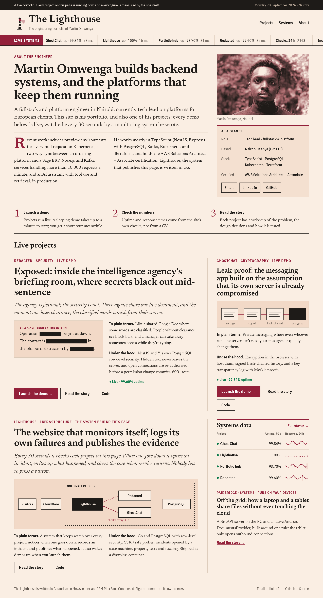
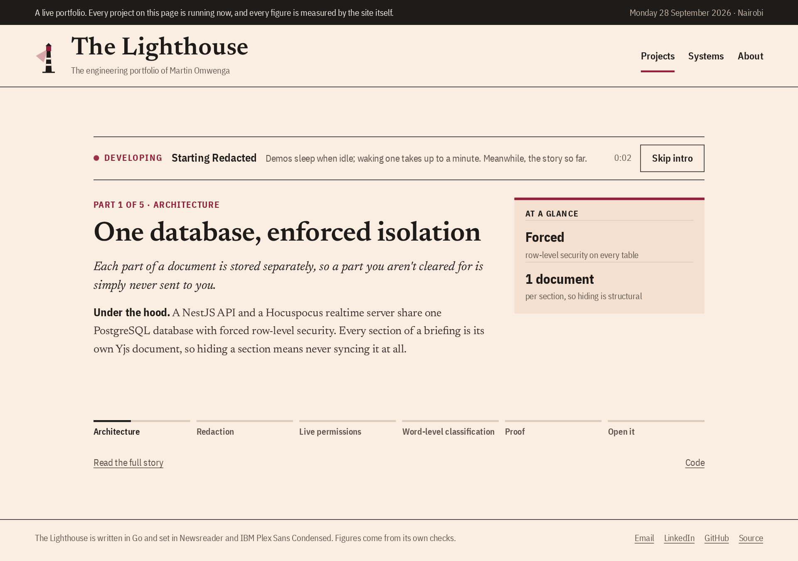
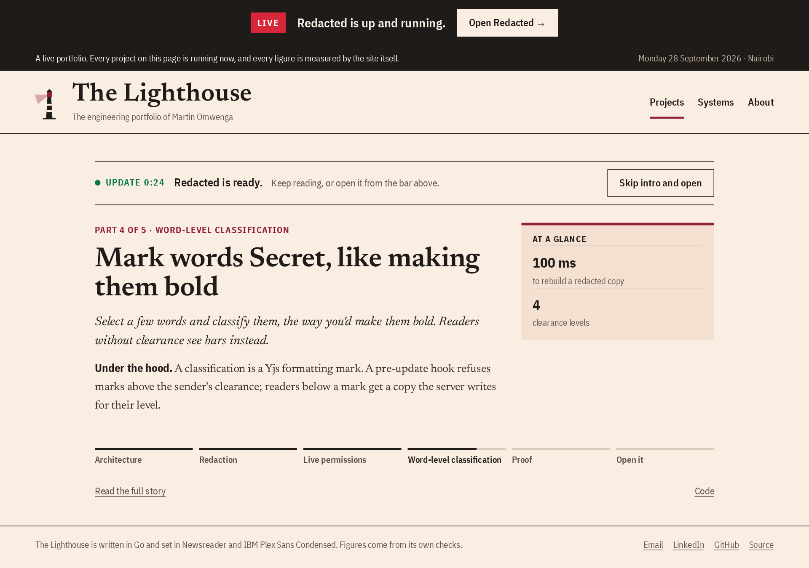
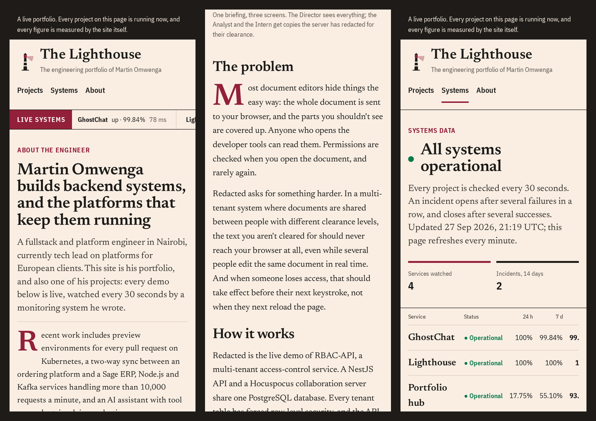

# Lighthouse

My engineering portfolio, published as a newspaper by the monitoring system that watches it.
Written in Go. It presents my projects as stories (the problem, the key design decisions, how each
is tested), starts their demos on demand with a short introduction while they wake up, monitors
all of them, opens and resolves incidents on its own, and publishes the results. Anyone can also try
the monitoring in a sandbox, without an account.



<sub>Screenshots are from a local run with simulated monitors and generated history.</sub>

## What it does

**The portfolio**

- **A front page** that leads with who I am, then the projects, each told twice: *in plain terms*
  for anyone, *under the hood* for engineers. A live ticker and a systems table show each
  project's uptime and response times, measured by Lighthouse itself.
- **A long-form story per project** ([example](docs/story.png)), written for a hiring team: the
  problem, how it was solved, the key decisions (the choice, why, and the trade-off), how it is
  tested, and what it doesn't do yet.
- **A launch page for every demo.** Demos sleep when nobody is using them, so launching one shows
  "Developing: starting Redacted" with a five-part technical introduction that advances on its
  own. Lighthouse polls the demo's health address, which also wakes it; when it answers, a LIVE bar
  drops in, and the demo opens once the introduction ends (or at once, with "Skip intro").
- **An About page** built from the CV ([screenshot](docs/about.png)).
- **Responsive and dependable:** every page works from phone to desktop, reads fully without
  JavaScript, and still renders if the monitoring data can't be loaded.
- **Content is configuration:** a folder of YAML (`deploy/site`: profile, projects, one story per
  project, media), validated strictly at startup so a typo fails there, with every problem listed.

| Starting | Ready |
|---|---|
|  |  |



**Monitoring**

- **Checks sites** over HTTP on a schedule: status code range, expected text and response time, recording
  each TLS certificate's expiry date. A pool of workers runs checks concurrently, and several instances can share
  one database without checking anything twice.
- **Opens and resolves incidents automatically.** A monitor must fail several checks in a row to be
  declared down, and pass several in a row to recover (hysteresis), so one blip doesn't page anyone
  and a flapping site doesn't open an incident every minute.
- **Incident timelines** with public updates and internal notes. Only public updates reach the
  status page.
- **A public systems page** ([screenshot](docs/status.png)) rendered on the server: overall state,
  uptime over 24 hours, 7 and 90 days, 90 days of daily 24-hour response-time sparklines (SVG drawn in Go), median and 95th-percentile latency,
  and past incidents. Also available as JSON at `/api/status`.
- **Visit analytics without cookies** ([how it works](#privacy-friendly-analytics)): which pages
  and projects are read, for how long, and which demos are opened; private `?ref=` tags show when a
  link sent with a job application is opened, and what that visitor went on to read.
- **A sandbox for visitors:** one click creates a private, throwaway workspace with simulated sites
  to break and fix (`up`, `slow`, `flaky`, `down`), and it expires after two hours.
- **The owner signs in with GitHub.** Only one GitHub account is admitted.

## Privacy-friendly analytics

- **No cookies, no local storage, no stored IP addresses.** A visitor is an HMAC of their IP address
  and user agent, keyed with a random salt that exists for one UTC day and is then deleted: enough
  to count unique readers and follow one visit across pages, not enough to recognise anyone the
  next day or recover an IP. The API's database role can't read the salts; one narrow function
  hands out today's.
- **Signals are respected before anything is sent:** Global Privacy Control and Do Not Track stop
  the script, and the server checks again. Bots and the signed-in owner aren't counted.
- **Engaged time is measured by the server.** The page sends a heartbeat every 15 seconds only while
  it is visible and in use; each heartbeat can add at most 20 seconds, measured from the previous
  one on the server, so a client can't claim time that didn't pass.
- **Public numbers hide small counts.** The systems page shows readers per project over 30 days;
  anything under five is shown as "fewer than 5". The detailed report (pages, projects, `?ref=`
  tags, referrers, devices) is the owner's alone, at `/api/analytics`.
- **Tags don't spread:** a `?ref=` tag is read once, then removed from the address bar.
- Records are deleted after 90 days. The rules are explained to visitors at `/privacy`.

## Security

| Concern | How it's handled |
|---|---|
| One visitor seeing another's data | PostgreSQL row-level security, forced on every table and keyed on a transaction-local tenant. The app connects as a role that can't bypass or disable it; a query without a tenant sees nothing. Composite foreign keys stop rows from pointing across tenants. |
| Using the monitor to reach internal services (SSRF) | Checks refuse private, loopback, link-local and CGNAT addresses. The check runs on the address actually dialled, after DNS, so hostnames that resolve inward and redirects are caught too. Sandboxes can't send real traffic at all. |
| Leaking internals on the status page | Failures are stored as categories (`timeout`, `tls`, …), never raw errors. Incidents on private monitors stay private, even after the monitor is deleted. |
| Session theft and CSRF | Random session tokens in HttpOnly, SameSite cookies; the database stores only their SHA-256. Writes from other origins are refused. OAuth state is bound to the browser. |
| Abuse | Rate limits on sandbox creation and writes; strict JSON decoding with size limits; a strict Content Security Policy. Readiness checks for demos are cached and shared, so however many visitors wait on a launch page, a demo gets one health request at a time. Demos' internal health addresses never appear in public output. |
| Unsafe deployments | Configuration refuses to start in production with the development login enabled, without HTTPS, or without the owner's GitHub ID, and lists every problem at once. |

## Tests

```sh
go test -race ./...
```

- **Integration tests against real PostgreSQL** (testcontainers-go). Each test gets its own
  database, cloned from a migrated template in milliseconds, so tests run in parallel.
- **Isolation tests** that try to read, change and link to another tenant's rows, and try to switch
  row-level security off as the app role.
- **Property tests** (rapid) for the incident state machine over random check sequences, and for
  uptime rounding.
- **Fuzzing** for monitor validation, the SVG sparkline and analytics page paths.
- **Analytics tests:** tagged visits attributed across pages; Global Privacy Control, Do Not Track,
  bots and the owner never counted; engaged time capped by the server; events counted once;
  public counts under five hidden; salts rotating daily and unreadable by the app role.
- **Content tests:** the shipped site loads and validates, every page of it renders without
  template errors or inline styles (which the CSP would block), and no internal address appears in
  public output.
- **Launch-page tests** in a real browser (Playwright, run locally): the introduction advances,
  the page switches to ready when the demo answers, opens it after the last slide, skip works,
  and the page is complete without JavaScript.
- **End-to-end HTTP tests:** GitHub sign-in against a fake GitHub (owner, stranger, forged state),
  sandbox isolation, cross-site requests, status-page leaks, incident pagination.
- The important tests have been checked to fail when the protection they cover is removed
  (the RLS policy, atomic claiming, the origin check, the owner check, private-incident hiding).

CI runs gofmt, `go vet`, staticcheck, the tests with the race detector, fuzzing, govulncheck,
gitleaks, CodeQL, a Trivy scan of the image, and a Docker Compose smoke test.

## Run it

```sh
cp .env.example .env   # set the two passwords; DEV_LOGIN=true for a local owner login
docker compose up --build
```

Then open <http://localhost:8080>. The pages read `deploy/site`; point `SITE_DIR` at another folder
to use your own. `POST /auth/dev` signs you in as the owner locally;
`POST /api/sandbox` starts a sandbox.

The image is a static binary on a distroless base, running as a non-root user with a read-only
filesystem. `lighthouse migrate` applies migrations as the database owner and creates the app's
least-privileged role; `lighthouse serve` runs the server, scheduler and housekeeping.

## Design

```
cmd/lighthouse       serve | migrate | healthcheck
internal/config      settings from the environment, validated together
internal/store       PostgreSQL: migrations, row-level security, queries
internal/monitor     probes (HTTP, simulated), the incident state machine, the scheduler
internal/status      status page data and the SVG sparkline
internal/site        the portfolio content (profile, projects, stories) and demo readiness
internal/auth        sessions, GitHub OAuth, sandboxes
internal/web         routes, middleware, HTML templates, the JSON API
```

Choices worth explaining:

- **Server-rendered pages.** These pages are read far more often than anything else, and they
  should load fast and work when things are broken. Go's `html/template` escapes by context. The
  only script is the launch page's introduction, and the page works without it.
- **A broadsheet, because the data is real.** The newspaper design (Newsreader and IBM Plex Sans
  Condensed on pink paper, one claret accent) carries live figures: the "markets data" is uptime.
  Fonts are served from the site itself, so the Content Security Policy allows nothing from other
  origins, not even inline styles.
- **The database is the queue.** Due monitors are claimed with one atomic `UPDATE`, so there is no
  separate queue or lock service to run, and instances can be added freely.
- **Probes run outside transactions.** A check can take 30 seconds; holding a database
  connection that long would limit concurrency to the pool size.

## Roadmap

- A console for the sandbox and the owner
- Guided tutorials for demos that need one
- Deployment with Terraform and k3s on Oracle Cloud's free tier, behind Cloudflare
