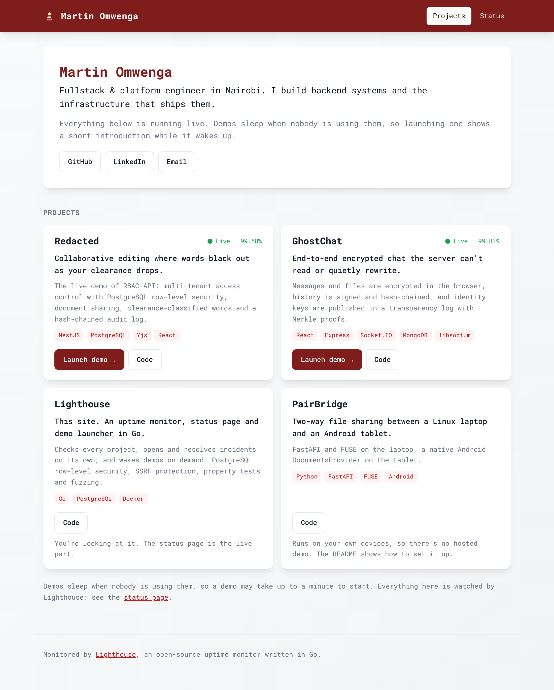

# Lighthouse

The front door to my portfolio, written in Go. It lists my projects, starts their demos on demand
(introducing each one while it wakes up), monitors all of them, opens and resolves incidents on its
own, and publishes a status page anyone can read. Anyone can also try the monitoring in a sandbox,
without an account.



<sub>Screenshots are from a local run with simulated monitors and generated history.</sub>

## What it does

**The hub**

- **A project list** with each project's live status and 90-day uptime, from its monitor.
- **A launch page for every demo.** Demos sleep when nobody is using them, so launching one shows
  "Starting Redacted…" with a short introduction to the project. Lighthouse polls the demo's health
  address, which also wakes it, and opens the demo when both it and the visitor are ready. The
  visitor can skip ahead once it's up; a demo with a guided tour offers the choice at the end.
- **Built to degrade gracefully:** without JavaScript the introduction is a readable page with a
  plain link, and if the status can't be loaded the projects still show.
- **Projects are configuration:** a YAML file, validated at startup like the rest of the settings.

| Starting | Ready |
|---|---|
|  |  |

**Monitoring**

- **Checks sites** over HTTP on a schedule: status code range, expected text and response time, recording
  each TLS certificate's expiry date. A pool of workers runs checks concurrently, and several instances can share
  one database without checking anything twice.
- **Opens and resolves incidents automatically.** A monitor must fail several checks in a row to be
  declared down, and pass several in a row to recover (hysteresis), so one blip doesn't page anyone
  and a flapping site doesn't open an incident every minute.
- **Incident timelines** with public updates and internal notes. Only public updates reach the
  status page.
- **A public status page** ([screenshot](docs/status-light.png)) rendered on the server, no JavaScript: overall state, 90 days of daily
  uptime, 24-hour response-time sparklines (SVG drawn in Go), median and 95th-percentile latency,
  and past incidents. Also available as JSON at `/api/status`.
- **A sandbox for visitors:** one click creates a private, throwaway workspace with simulated sites
  to break and fix (`up`, `slow`, `flaky`, `down`), and it expires after two hours.
- **The owner signs in with GitHub.** Only one GitHub account is admitted.

## Security

| Concern | How it's handled |
|---|---|
| One visitor seeing another's data | PostgreSQL row-level security, forced on every table and keyed on a transaction-local tenant. The app connects as a role that can't bypass or disable it; a query without a tenant sees nothing. Composite foreign keys stop rows from pointing across tenants. |
| Using the monitor to reach internal services (SSRF) | Checks refuse private, loopback, link-local and CGNAT addresses. The check runs on the address actually dialled, after DNS, so hostnames that resolve inward and redirects are caught too. Sandboxes can't send real traffic at all. |
| Leaking internals on the status page | Failures are stored as categories (`timeout`, `tls`, …), never raw errors. Incidents on private monitors stay private, even after the monitor is deleted. |
| Session theft and CSRF | Random session tokens in HttpOnly, SameSite cookies; the database stores only their SHA-256. Writes from other origins are refused. OAuth state is bound to the browser. |
| Abuse | Rate limits on sandbox creation and writes; strict JSON decoding with size limits; a strict Content Security Policy. Readiness checks for demos are cached and shared, so however many visitors wait on a launch page, a demo gets one health request at a time. Demos' internal health addresses never appear in public output. |
| Unsafe deployments | Configuration refuses to start in production with the development login enabled, without HTTPS, or without the owner's GitHub ID, and lists every problem at once. |

## Tests

```sh
go test -race ./...
```

- **Integration tests against real PostgreSQL** (testcontainers-go). Each test gets its own
  database, cloned from a migrated template in milliseconds, so tests run in parallel.
- **Isolation tests** that try to read, change and link to another tenant's rows, and try to switch
  row-level security off as the app role.
- **Property tests** (rapid) for the incident state machine over random check sequences, and for
  uptime rounding.
- **Fuzzing** for monitor validation and the SVG sparkline.
- **Launch-page tests** in a real browser (Playwright, run locally): the introduction advances,
  the page switches to ready when the demo answers, opens it after the last slide, skip works,
  and the page is complete without JavaScript.
- **End-to-end HTTP tests:** GitHub sign-in against a fake GitHub (owner, stranger, forged state),
  sandbox isolation, cross-site requests, status-page leaks, incident pagination.
- The important tests have been checked to fail when the protection they cover is removed
  (the RLS policy, atomic claiming, the origin check, the owner check, private-incident hiding).

CI runs gofmt, `go vet`, staticcheck, the tests with the race detector, fuzzing, govulncheck,
gitleaks, CodeQL, a Trivy scan of the image, and a Docker Compose smoke test.

## Run it

```sh
cp .env.example .env   # set the two passwords; DEV_LOGIN=true for a local owner login
docker compose up --build
```

Then open <http://localhost:8080>. The hub reads `deploy/projects.yaml`; point `PROJECTS_DIR` at
another folder to use your own. `POST /auth/dev` signs you in as the owner locally;
`POST /api/sandbox` starts a sandbox.

The image is a static binary on a distroless base, running as a non-root user with a read-only
filesystem. `lighthouse migrate` applies migrations as the database owner and creates the app's
least-privileged role; `lighthouse serve` runs the server, scheduler and housekeeping.

## Design

```
cmd/lighthouse       serve | migrate | healthcheck
internal/config      settings from the environment, validated together
internal/store       PostgreSQL: migrations, row-level security, queries
internal/monitor     probes (HTTP, simulated), the incident state machine, the scheduler
internal/status      status page data and the SVG sparkline
internal/hub         the project catalog and demo readiness
internal/auth        sessions, GitHub OAuth, sandboxes
internal/web         routes, middleware, HTML templates, the JSON API
```

Choices worth explaining:

- **Server-rendered pages.** The hub and status page are read far more often than anything else,
  and they should load fast and work when things are broken. Go's `html/template` escapes by
  context. The only script is the launch page's slideshow, and the page works without it.
- **Design carried over** from the original version of this project (an incident tracker in Vue):
  the deep-red bar, Roboto Mono, white cards on soft gray. The font is served locally, so the
  Content Security Policy allows nothing from other origins.
- **The database is the queue.** Due monitors are claimed with one atomic `UPDATE`, so there is no
  separate queue or lock service to run, and instances can be added freely.
- **Probes run outside transactions.** A check can take 30 seconds; holding a database
  connection that long would limit concurrency to the pool size.

## Roadmap

- Privacy-friendly visit analytics (no cookies, no stored IPs)
- A console for the sandbox and the owner
- Guided tutorials for demos that need one
- Deployment with Terraform and k3s on Oracle Cloud's free tier, behind Cloudflare
